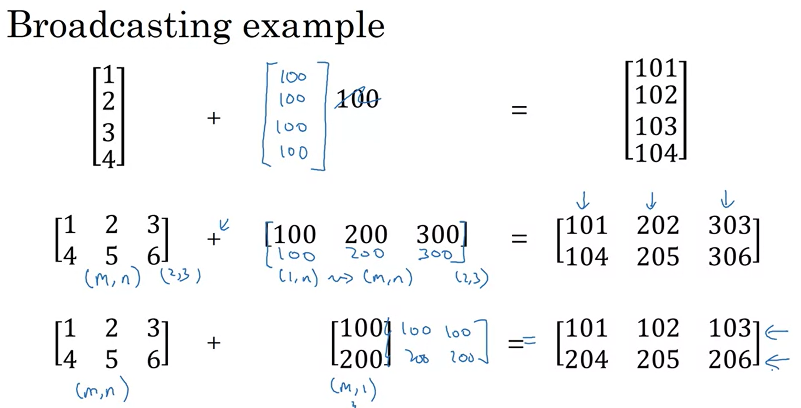

# ¿Qué es la Vectorización?
La vectorización es una técnica que permite realizar operaciones en grandes cantidades de datos de una vez, en lugar de hacerlo elemento por elemento con bucles explicitos. La idea es aprovechar operaciones eficientes que las bibliotecas de programación, como NumPy en Python, ya tienen implementadas.

### ¿Por qué es Importante?

- **Velocidad:** La vectorización puede hacer que tu código sea mucho más rápido. Cuando trabajas con grandes conjuntos de datos, como en el deep learning, este aumento de velocidad es crucial. Los métodos vectorizados suelen ser cientos de veces más rápidos que los métodos que usan bucles explicitos.

- **Eficiencia:** Los cálculos vectorizados se realizan en bloques de datos, lo que permite a los procesadores (CPU o GPU) trabajar de manera más eficiente. Esto implica resultados más rápidos y con menos tiempo de espera.

### Ejemplo de Vectorización

Supongamos que quieres calcular una operación con dos vectores, $Z = W^{t} X + b$. Donde, $W$ y $X$ son vectores (por ejemplo, con 1 millón de elementos).

- **Sin Vectorización (con bucles explícitos):**
    ```python
    Z = 0
    for i in range(len(X)):
     Z += W[i] * X[i]
    Z += B
    ```

    Esto significa que estás usando un bucle para multiplicar cada elemento de $W$ con el elemento correspondiente de $X$ y luego sumando los resultados.


- **Con Vectorización:**
    ```python
    import numpy as np
    Z = np.dot(W, X) + B
    ```

    Aquí, 'np.dot' realiza el producto punto de $W$ y $X$ en una sola operación, y la suma del sesgo $B$ se hace directamente.


**Demostración de Velocidad**

Al comparar el tiempo que tarda en realizar el cálculo usando la vectorización frente a un bucle explícito se encontro que:

- Versión Vectorizada: ~1.5 milisegundos
- Versión con Bucle Explícito: ~500 milisegundos

La versión vectorizada es aproximadamente 300 veces más rápida que la versión con bucle explícito.

<p>&nbsp;</p><p>&nbsp;</p>

Pequeño recordatorio antes de empezar con las vectorizaciones

**Propagación hacia adelante y hacia atrás en la regresión logística**

- **Propagación hacia adelante (Forward propagation):** Calculas las predicciones para todos los ejemplos de entrenamiento de una vez. Esto involucra calcular $Z$ y luego aplicar la función sigmoide para obtener $A$.

- **Propagación hacia atrás (Backward propagation):** Calculas los gradientes (derivadas) de la función de costo con respecto a los parámetros del modelo, $W$ y $b$, para actualizar estos parámetros.

<p>&nbsp;</p><p>&nbsp;</p>

## Vectorización de la regresión logística en la propagación hacia adelante

En la **regresión logística tradicional** se realizan cálculos **individualmente** para cada ejemplo de entrenamiento. Es decir, se calcula $z^{1} = w^{T} x^{1} + b$, $z^{2} = w^{T} x^{2} + b$, ...., $z^{m} = w^{T} x^{m} + b$. Y luego $a^{1} = \sigma(z^{1})$, $a^{2} = \sigma(z^{2})$, ...., $a^{m} = \sigma(z^{m})$, para cada muestra.

Sin embargo, con la **vectorización** se puede calcular $z$ y $a$ al mismo momento, empleando matrices sin la necesidad de bucles.

- **Cálculo de $z$:** para calcular $z$ en todos los ejemplo a la vez se aplica la siguiente operación.

```python
Z = np.dot(wT, x) + b
```

- **Cálculo de $a$:** una vez se tiene $z$, se aplica la función sigmoide para obtener $A$ en una sola operación. 

```python
A = sigmoid(Z)
```

<p>&nbsp;</p>

## Vectorización de la regresión logística en la propagación hacia atrás

Al igual que en la propagación hacia adelanlante, en lugar de realizar los cálculos indiviualmente para **calcular el gradiente** $dz^{1} = a^{1} - y^{1}$, $dz^{2} = a^{2} - y^{2}$, ...., $dz^{m} = a^{m} - y^{m}$. Se puede vectorizar el cálculo de manera que $dZ = A - Y$.

```python
dZ = A - Y
```

Luego, se calculan $dW$ (gradente de los pesos) y $db$ (gradente del sesgos):

1. **Calcular $dW$:** Multiplica la matriz de entrada $x$ por el gradiente $dz$ transpuesto.

    En lugar de realizarlo individualemente como:

        dw = 0
        dw += X^(1) dZ^(1)
        dw += X^(2) dZ^(2)
        ...
        dw = dw/m

    La fórmula vectorizada es:

    $dw = \frac{1}{m} X dZ^{T}$

    En phyton:
    ```python
    dW = (1 / m) * np.dot(X, dZ.T)
    ```


2. **Calcular db:** Suma el elemento $dz$

    Calculado de forma individual

        db = 0
        db += dZ^(1)
        db += dZ^(2)
        ...
        db = db/m
    
    La fórmula vectorizada es:

    $db = \frac{1}{m} \sum_{i=1}^{m} dz^{i}$

    En phyton:
    ```python
    db = (1 / m) * np.sum(dZ)
    ```

Y por último, se actualizan los parámetros W y b utilizando los gradientes calculados y la tasa de aprendizaje. 

```python
W = W - alpha * dW
b = b - alpha * db
```

<p>&nbsp;</p>


## Implementación de la Regresión Logística

```python
# Propagación hacia adelante
Z = np.dot(W.T, X) + b
A = sigmoid(Z)

# Propagación hacia atrás
dZ = A - Y
dW = (1 / m) * np.dot(X, dZ.T)
db = (1 / m) * np.sum(dZ)

# Actualización de los parámetros
W = W - alpha * dW
b = b - alpha * db
```

 Aunque, si queremos tener multiples iteraciones de descenso de gradiente aquí sí que necesitaríamos aplicar un bucle explicito.

```python
for i in range(1000):
    # Propagación hacia adelante
    Z = np.dot(W.T, X) + b
    A = sigmoid(Z)

    # Propagación hacia atrás
    dZ = A - Y
    dW = (1 / m) * np.dot(X, dZ.T)
    db = (1 / m) * np.sum(dZ)

    # Actualización de los parámetros
    W = W - alpha * dW
    b = b - alpha * db
```

<p>&nbsp;</p>

## Ejemplo práctico de Vectorización

Calcula el porcentaje de carbohidratos, proteínas y grasas en 100g de diferentes alimentos:

|                   | Manzana | Pollo | Huevos | Patatas |
|-------------------|---------|-------|--------|---------|
| Carbohidratos (g) | 56.0    | 0     | 4.4    | 68.0    |
| Proteínas (g)     | 1.2     | 104.0 | 52.0   | 8.0     |
| Grasas (g)        | 1.8     | 135.0 | 99.0   | 0.9     |


Por ejemplo para calcular el porcentaje de carbohidratos en las manzanas tenemos que hacer: 
1. Calcular las calorías totales por alimento:

    Para 100 g de manzana: 56 + 1.2 + 1.8 = 59 calorías totales.

2. Calcular el porcentaje de cada macronutriente:

    Para 56 cal de carbohidratos / 59 cal totales = 94.9%

Ahora en programación se realizaría de la siguiente forma:

```python
import numpy as np

# Define la matriz A con las calorías
A = np.array([[56.0, 0.0, 4.4, 68.0],
              [1.2, 104.0, 52.0, 8.0],
              [1.8, 135.0, 99.0, 0.9]])

# Axis=0 significa que se suman los valores verticalmente 
cal = A.sum(axis=0)

# Divide cada valor de la matriz A por el total de calorías de la columna correspondiente y multiplica por 100 para obtener el porcentaje
percentage = 100 * A / cal.reshape(1, 4)

print("Calorías totales por alimento:", cal)
print("Porcentajes de calorías:", percentage)

```

Otros ejemplos para entender como se suman matrices en python:

<p align="center">
  
</p>
